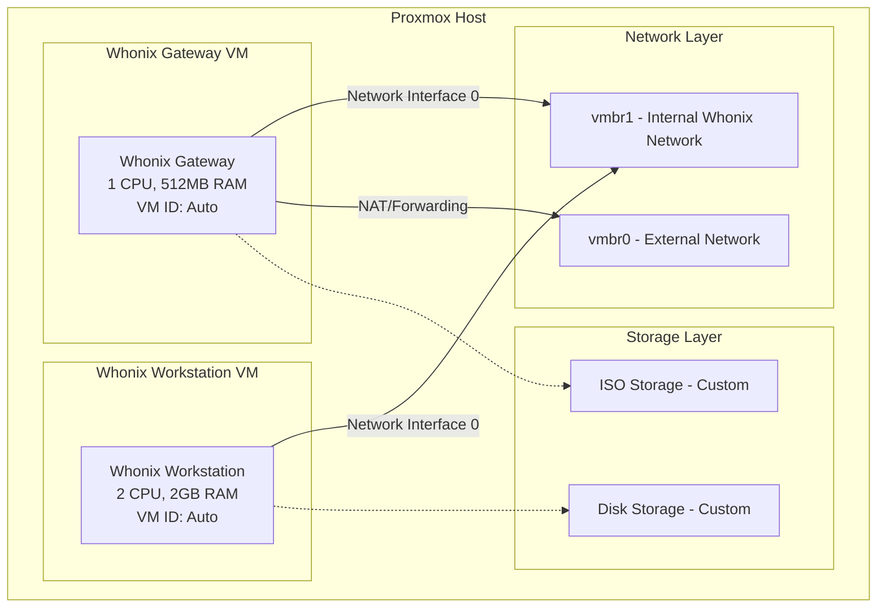
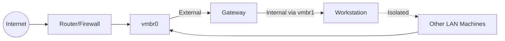
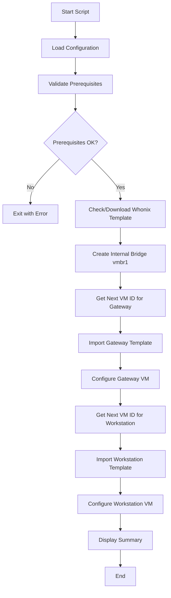

# Whonix Proxmox Setup Script - Architecture Plan

## Overview

This document outlines the architecture and design for an automated bash script that deploys Whonix Gateway and Workstation VMs on Proxmox VE 9.1.5.

## System Architecture



## Network Flow



### Network Connectivity Table

| Component | Network Interface | Bridge | Can Access |
|-----------|------------------|--------|------------|
| Whonix Gateway | eth0 | vmbr1 (internal) | Workstation only |
| Whonix Gateway | eth1 | vmbr0 (external) | Internet, LAN |
| Whonix Workstation | eth0 | vmbr1 (internal) | Gateway only |
| Other LAN machines | - | vmbr0 | Cannot reach Workstation |

## Script Components

### 1. Configuration Section
All user-configurable variables will be defined at the top of the script:

```bash
# Storage Configuration
STORAGE_ISO="local"           # Storage for ISO files
STORAGE_DISK="local-lvm"      # Storage for VM disks

# Resource Allocation
GATEWAY_CPU=1
GATEWAY_RAM=512
WORKSTATION_CPU=2
WORKSTATION_RAM=2048

# Disk Size (GB)
GATEWAY_DISK_SIZE=10
WORKSTATION_DISK_SIZE=20

# VM Names
GATEWAY_NAME="Whonix-Gateway"
WORKSTATION_NAME="Whonix-Workstation"

# Auto-start on Proxmox boot
AUTOSTART=true
```

### 2. Helper Functions

| Function | Purpose |
|----------|---------|
| `get_next_vm_id()` | Finds the next available VM ID in Proxmox |
| `check_storage_exists()` | Validates storage backend exists |
| `list_available_storages()` | Lists all available Proxmox storage backends with usage stats |
| `check_vm_exists()` | Checks if a VM with given name already exists |
| `download_template()` | Downloads Whonix OVA from official source |
| `import_ova()` | Imports OVA template to Proxmox |
| `create_bridge()` | Creates internal network bridge vmbr1 |
| `configure_vm()` | Applies VM configuration settings |
| `show_progress()` | Displays progress bar for downloads/imports |
| `print_summary()` | Displays final deployment summary with access instructions |

### 3. Interactive UI Features

#### Storage Selection
The script will:
1. Auto-detect all available storage backends using `pvesm status`
2. Display them in a formatted table with type, total, used, and available space
3. Allow user to select storage for ISO and disk files via menu or accept defaults

Example output:
```
=== Available Storage Backends ===
Name         Type       Total(GB)  Used(GB)   Available(GB)  Usage%
--------------------------------------------------------------------
local        dir        500        120        380            24%
local-lvm    lvm        400        100        300            25%
nvme-ssd     zfs        1000       200        800            20%

ISO Storage: [local] (default: local)
Disk Storage: [local-lvm] (default: local-lvm)
```

#### Progress Updates
- Real-time progress bars for downloads and imports
- Percentage completion for each major step
- Estimated time remaining for long operations
- Color-coded status indicators (success, error, warning)

Example:
```
[1/6] Downloading Whonix Gateway template...
  [====================........]  65%  (2.1 GB / 3.2 GB)
  ETA: 2 minutes remaining
```

#### Final Summary
At completion, display a comprehensive summary with box-drawing characters:
```
+------------------------------------------------------------------+
|              Whonix Deployment Complete!                         |
+------------------------------------------------------------------+
|  VM Name          VM ID    Status      Auto-Start                |
|  ----------------------------------------------------------------|
|  Whonix-Gateway   100      Running     Yes                       |
|  Whonix-Workstation 101    Running     Yes                       |
+------------------------------------------------------------------+
|  Network Configuration:                                          |
|    - External Bridge: vmbr0 (Gateway -> Internet/Tor)            |
|    - Internal Bridge: vmbr1 (Gateway <-> Workstation)            |
+------------------------------------------------------------------+
|  Access Instructions:                                            |
|    1. Gateway Console: qm terminal 100                           |
|    2. Workstation Console: qm terminal 101                       |
|    3. Gateway IP: 10.0.3.1 (internal) / DHCP (external)          |
|    4. Workstation IP: 10.0.3.2 (internal only)                   |
|    5. All Workstation traffic is routed through Tor              |
+------------------------------------------------------------------+
|  Next Steps:                                                     |
|    - Wait 2-3 minutes for Whonix services to initialize          |
|    - Gateway will automatically connect to Tor network           |
|    - Check Tor status in Gateway console                         |
|    - Start Workstation VM after Gateway is fully booted          |
+------------------------------------------------------------------+
```

### 4. Main Execution Flow



### 5. Prerequisites Validation

The script will validate:
- Running on Proxmox host (check for `pvesh`, `qm` commands)
- Root privileges
- Storage backends exist
- Sufficient disk space
- Network connectivity for downloads

### 6. Download Sources

Whonix templates will be downloaded from:
- **Primary**: `https://dl.whonix.org/` (official Whonix downloads)
- **Format**: OVA (Open Virtual Appliance)
- **Version**: Latest stable release

### 6. VM Configuration Details

#### Whonix Gateway
- CPU: 1 core
- RAM: 512 MB
- Disk: 10 GB (customizable)
- Network: 
  - eth0 → vmbr1 (internal)
  - Optional: eth1 → vmbr0 (external, for NAT)
- Auto-start: Enabled
- BIOS: SeaBIOS (default)

#### Whonix Workstation
- CPU: 2 cores
- RAM: 2048 MB
- Disk: 20 GB (customizable)
- Network:
  - eth0 → vmbr1 (internal only)
- Auto-start: Enabled (after Gateway)
- BIOS: SeaBIOS (default)

### 8. Error Handling

The script will implement:
- Exit codes for different failure scenarios
- Rollback capability for partial deployments
- Clear error messages with suggestions
- Log file creation at `/var/log/whonix-setup.log`

### 9. User Interaction

- Confirmation prompts before destructive operations
- Progress indicators during downloads and imports
- Summary display before final confirmation
- Option to skip confirmation with `--yes` flag

### 10. File Structure

```
whonix-proxmox-script/
├── README.md                      # Usage instructions
├── whonix-proxmox-setup.sh        # Main setup script
├── plans/
│   └── whonix-proxmox-plan.md     # This architecture document
└── logs/                          # Log files directory
    └── .gitkeep
```

### 11. Security Considerations

1. **Template Verification**: Downloaded templates should be verified against official checksums
2. **Network Isolation**: Workstation VM should only communicate via Gateway
3. **Minimal Permissions**: Script requires root but should minimize privilege exposure
4. **No Hardcoded Credentials**: All configuration via variables

## Next Steps

1. Review and approve this architecture plan
2. Switch to Code mode for implementation
3. Create the script with all components
4. Test on Proxmox VE 9.1.5 environment
5. Document any issues or improvements

## Questions for Review

- Are the default resource allocations appropriate?
- Is the network topology correct for your use case?
- Should we add TPM passthrough support for additional security?
- Do you need support for multiple Workstation VMs per Gateway?
